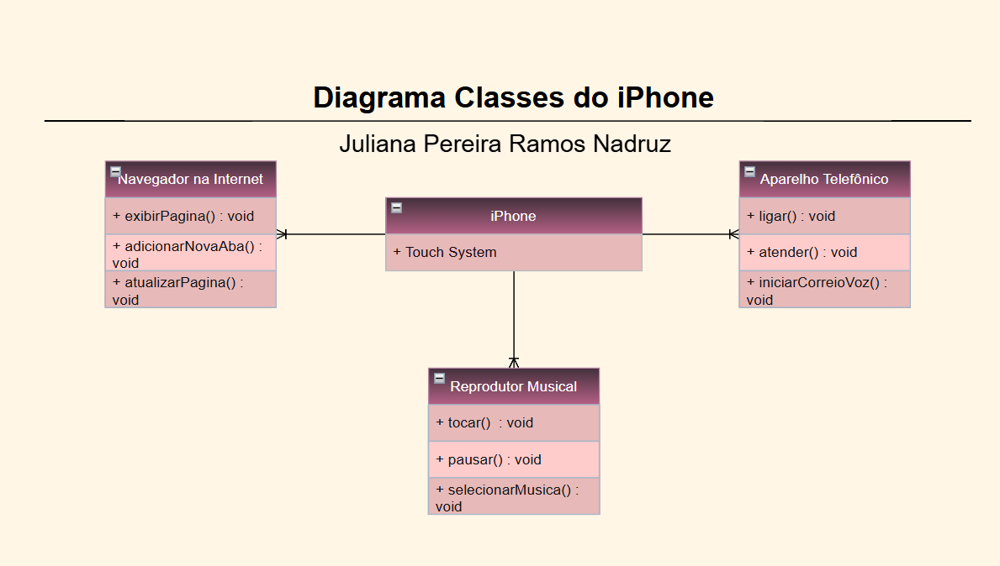

# 📱 Modelando o iPhone com UML
Este projeto foi desenvolvido com base no desafio proposto em vídeo de lançamento do iPhone (2017). O objetivo foi **modelar em UML** as principais funções do dispositivo, representando-o como:

* 🎵 **Reprodutor Musical**
* 📞 **Aparelho Telefônico**
* 🌐 **Navegador na Internet**

Após a modelagem, as **classes e interfaces** foram implementadas em **Java**, reforçando conceitos de **POO (Programação Orientada a Objetos)**.

 

## 🔹 Funcionalidades

### 🎵 Reprodutor Musical

* `tocar()`
* `pausar()`
* `selecionarMusica(String musica)`

### 📞 Aparelho Telefônico

* `ligar(String numero)`
* `atender()`
* `iniciarCorreioVoz()`

### 🌐 Navegador na Internet

* `exibirPagina(String url)`
* `adicionarNovaAba()`
* `atualizarPagina()`

## 📊 Diagrama UML

## 🛠️ Tecnologias Utilizadas

* Java ☕
* UML (diagramas de classes)
* IDE: *\[coloque aqui a sua, ex: Visual Studio Code / Eclipse]*

## 📌 Pré-requisitos

* Conhecimentos básicos de **Java**
* **Lógica de programação e POO**
* Computador com **Windows, Linux ou MacOS**
* IDE de sua preferência

## ✨ Autor

Projeto desenvolvido por **Juliana Pereira Ramos Nadruz** 👩🏻‍💻 como parte de estudos em UML e Programação Orientada a Objetos.
